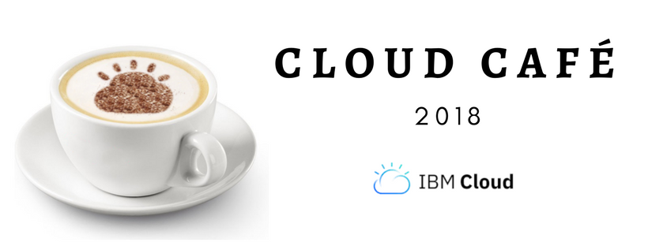

## Event Overview 
Do you want an environment to build an application quickly, without worrying about the underlying IT infrastructure? Or do you have a need for extending  your existing IT infrastructure in the cloud?  Are you a freelance developer working for multiple  clients? Or developing the next start up killer app?  Or working on appealing web and mobile front end  applications, to be integrated with your enterprise’s  back end applications?

IBM Cloud platform is what you need!  It is an open standards, cloud based, innovation  platform for building, running and managing  applications. Developers have access to a broad  portfolio of capabilities and re usable services  IBM, open source and 3rd party  across DevOps,  Big Data and Analytics, mobile and security. It helps  you to rapidly stitch together new applications, at  lower cost. You will learn as well to build cognitive  applications, using Watson Services in IBM Cloud  platform.

IBM Cloud Private is an application platform for  developing and managing on premises,  containerized applications. It is an integrated  environment for managing containers that includes  the container orchestrator Kubernetes, a private  image repository, a management console, and  monitoring frameworks.

## Agenda

**Morning**

- Introduction to IBM Cloud Private in context of IBM Cloud
- IBM Cloud Private Architecture concepts
- Intro to cloud-Native applications, microservices
- Migrating workloads to IBM Cloud Private
- Sizing and typical deployments
- ICP Demo, including Cloud Automation Manager
- Competitive positioning and value add
- Licensing and go-to market strategy

**Lunch!**

**Afternoon Labs**

- Installation
- CLI tour
- Sample App Deployment
- MicroServices builder

The lab guide is available [here](./lab_guide.md)

