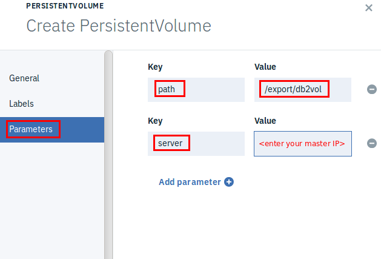

Deploying Db2 in Docker Containers on IBM Cloud private 
========================================================

In this lab you will deploy and run Db2 service on Kubernetes cluster in IBM Cloud private (ICp) environment.

More details on deploying DB2 on ICP can also be found here:  
https://developer.ibm.com/recipes/tutorials/db2-integration-into-ibm-cloud-private/

Business Scenario
-----------------

IBM Cloud private (ICp) has been installed in your company data center. Your application team has developed a web application, **StockTrader**, and ready to deploy it to the ICp environment. **StockTrader** is a microservice-based application utilizing various features of IBM WebSphere Liberty runtime (JAX-RS, Servlets, JPA, etc.) to interact with a set of database tables in DB2 and to send notifications to Slack via JMS over MQ and Open Whisk as shown in the application architecture diagram below.

To prepare the environment for the application deployment, you are asked by your operation team to deploy DB2 service required by the application in a Kubernetes cluster in IBM Cloud private environment.

Objective
---------

The objectives of this lab are to:

-   Learn how to run Kubernetes in IBM Cloud private (ICp).

-   Learn how to deploy DB2 as service to ICp using Docker container and Kubernetes cluster.

-   Learn how to configure and use DB2 service in ICp Kubernetes environment

Prerequisites
-------------

The following prerequisites must be completed prior to beginning this lab:

-   Familiarity with basic Linux commands

1.  In the web browser, enter your ICP UI url:

        https://<master_IP>:8443

2.  If you see “You connection is not secure” page, click **Advanced -\	Add Exception -\	Confirm Security Exceptions**

    

1.  You are now at the IBM Cloud private (ICp) login page, accept the default User ID and Password as: **admin/admin** and click **Login**.

    

    The ICp dashboard is shown as followings.

    

### setup Kubernetes client

You are going to use the Kubernetes client command **kubectl** to deploy the microservice application to ICP through command line. To do that, we need to configure the **kubectl** first.

1.  In the ICp **Dashboard** page, click **admin** on the top right corner and select **Configure Client** from the dropdown menu.

	

1.  Click the **copy** icon to copy all kubectl commands in the box.

	

1.  Open a terminal window and paste the kubectl commands to the terminal window, and press **Enter**.

	

1.  Now the kubectl is configured, you can issue the following kubectl command to see the current cluster info:

        kubectl cluster-info

	

	You can see that several components are created automatically for you in ICp: the master, the Heapster, the image-manager, the DNS server, and the Tiller.

1.  List the nodes in the ICp Kubernetes cluster by running the following command. In this lab, there should be only one node running.

        kubectl get nodes

	

### Create Persistent Volume

To deploy DB2 service to Kubernetes cluster, you need to create a persistent volume that uses the **ReadWriteOnce** (RWO) access mode. When you assign this access mode to the volume, only one node can mount it with read/write permissions. This can be done in the ICp UI, and should be created before the deployment.

In this lab, we are going to create such volume in the file system.

1.  Open a terminal window and create a new file directory named **myVolume** under /home/ibmdemo directory with commands:

        cd /export
        mkdir db2vol
        chmod a+w -R db2vol/

1.  Go back to IBM Cloud private console, and use the upper left menu to navigate to the **Platform/Storage** page

	

1.  On the **Storage** page, click **Create PersistentVolume**.

	

1.  In the **Create PersistentVolume** page, click **General** and set the **Name** as: **db2vol**, **Capacity** as **1** (GB), and **Access mode** as **Read write once**.

	

1.  Select **Storage type** as: **NFS**

	

1.  Click **Parameters** and set and enter two Key/Value pairs as:

	**Key Value**

        server: <master_IP>
        path: /export/db2vol

	

1.  Click **Create**, the PersistentVolume db2vol will be created.

	

### Deploy DB2 service to ICP Kubernetes cluster

With IBM Cloud private, you have 2 ways to install IBM DB2 service:

1.  using IBM Cloud private’s Catalog UI

2.  from the command line using “Helm” commands

In this lab we are going to use the ICp Catalog UI to deploy DB2 service.

1.  **Deploy the Db2 service with ICp Catalog UI**

1.  Go back to ICp console in the Firefox web browser, and navigate to **Catalog-\Helm Charts**.

	

1.  Type **db2** in the search box and select **ibm-db2oltp-dev** chart

	

1.  To install to **ibm-db2oltp-dev** chart, click **Configure.**

	

1.  In the **ibm-db2oltp-dev** chart configuration page

    1.  In the **Configuration** section, enter **mydb2** as the Release name, check the license agreement box and set the Target namespace as **default.**

	

1.  In the **Docker image configuration** section, select the [*http://ibm.biz/db2-dsm-license*](http://ibm.biz/db2-dsm-license) url in the **secret** field and right click to open the link in a web browser New Tab.

	

1.  In the [*http://ibm.biz/db2-dsm-license*](http://ibm.biz/db2-dsm-license) page accept the license agreement, copy the secret key value starting after “Your key is – ” and end with “==”. The copied string should look like this:

	

1.  Paste the key value to the secret field of the **ibm-db2oltp-dev** chart

	

1.  In the **Db2 instance configuration** section, set the **db2inst name** and **password** as: **db2inst1/password**

	

1.  In the Database configuration options section, eet the database as: **sample**.

	

1.  In the Data volume configuration section, set the Size of the volume claim as: **1** Gi

	

1.  Click **Install**

	

1.  Depending on compute and storage speeds, it may take several minutes to install and set up the sample database. After the deployment, you can navigate to **Workloads/Deployments** page to see the deployed db2 application is up and running.

	

###  Verify the DB2 deployment and configure DB2

1. Observe how the DB2 deployment is being created. It takes a minute or two to pull the db2 image from the repo.

        kubectl get pods
        kubectl describe pod <your db2 pod name>

    Once DB2 service is installed, you are ready to use it. If you want a simple JDBC UI to validate it, you will need to find the IP address and port to run JDBC calls from. You might also need to have the Db2 driver file as well.

1.  From the terminal window where the kubectl is configured, run the following command to find the service name for your Db2:

        kubectl get svc

	

	You can see your db2 service port as 30961 and this indicates your db2 service IP address:port to use is: [*http://192.169.169.20:30961*](http://192.169.169.20:30961/).

	Note: The port number is 30961 in this example and you might have a different port number in your own environment.

**Congratulations! You have successfully completed the lab “Deploying DB2 in Docker Containers on IBM Cloud private”**
