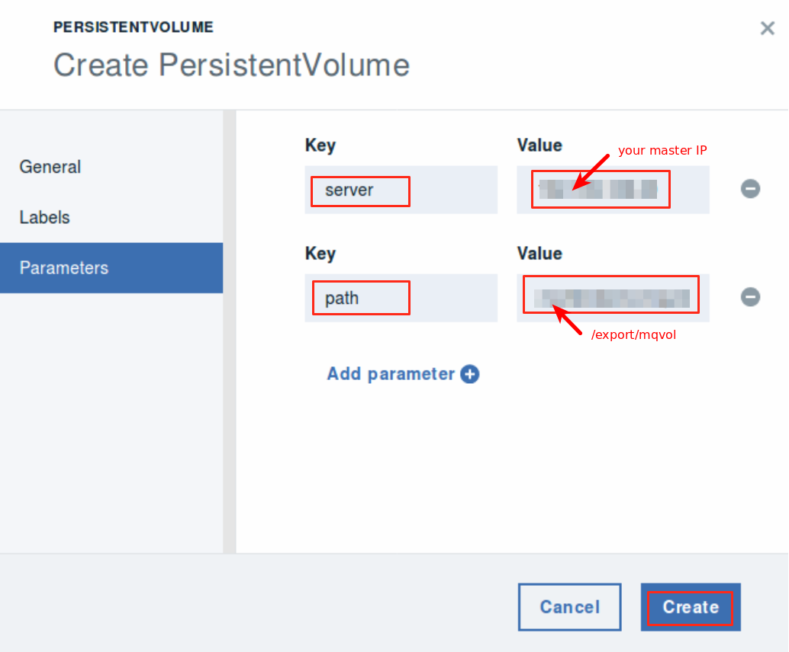

Deploying MQ in Docker Containers on IBM Cloud private 
=======================================================

In this lab you will deploy and run MQ manager service on Kubernetes cluster in IBM Cloud private (ICp) environment.

Business Scenario
-----------------

IBM Cloud private (ICp) has been installed in your company data center. Your application team has developed a web application, **StockTrader**, and ready to deploy it to the ICp environment. **StockTrader** is a microservice-based application utilizing various features of IBM WebSphere Liberty runtime (JAX-RS, Servlets, JPA, etc.) to interact with a set of database tables in DB2 and to send notifications to Slack via JMS over MQ and Open Whisk as shown in the application architecture diagram below.

To prepare the environment for the application deployment, you are asked by your operation team to deploy MQ service required by the application in a Kubernetes cluster in IBM Cloud private environment.

Objective
---------

The objectives of this lab are to:

-   Learn how to run Kubernetes in IBM Cloud private (ICp).

-   Learn how to deploy MQ as service to ICp using Docker container and Kubernetes cluster.

-   Learn how to configure and use MQ service in ICp Kubernetes environment

The following prerequisites must be completed prior to beginning this lab:

-   Familiarity with basic Linux commands

The following symbols appear in this document at places where additional guidance is available.

Lab Tasks
---------

During this lab, you will complete the following tasks:

-   Deploy and run the MQ service on ICp Kubernetes cluster.

-   Set MQ configuration

-   Test and verify the MQ deployment.

Execute Lab Tasks
-----------------

### Log in and get started

1.  In the web browser, enter your ICP UI url:

        https://<master_IP>:8443

1.  If you see “You connection is not secure” page, click **Advanced -\	Add Exception -\	Confirm Security Exceptions**

    

1.  You are now at the IBM Cloud private (ICp) login page, accept the default User ID and Password as: **admin/admin** and click **Login**.

    

    The ICp Dashboard is shown as followings.

    

### Setup Kubernetes client

You are going to use the Kubernetes client command **kubectl** to deploy the microservice application to ICp through command line. To do that, we need to configure the **kubectl** first.

1.  In the ICp dashboard page, click **admin** on the top right corner and select **Configure Client** from the dropdown menu.

    

1.  Click the **copy** icon to copy all kubectl commands in the box.

    

1.  Open your terminal and paste the kubectl commands to the terminal window, and press **Enter**.

    

1.  Now the kubectl is configured, you can issue the following kubectl command to see the current cluster info:

        kubectl cluster-info

    
You can see that several components are created automatically for you in ICp: The master, the Heapster, the image-manager, the DNS server, and the Tiller.

1.  List the nodes in the ICp Kubernetes cluster by running the following command. In this lab, there should be only one node running.

        kubectl get nodes
    
    

### Create Persistent Volume

To deploy MQ to Kubernetes cluster, you need to create a persistent volume that uses the **ReadWriteOnce** (RWO) access mode. When you assign this access mode to the volume, only one node can mount it with read/write permissions. This can be done in the ICp UI, and should be created before the deployment.

In this lab, we are going to create such volume in the file system.

1.  Open a terminal window and create a new file directory named **mqvol** under `/export` directory with commands:

        cd /export
        mkdir mqvol
        chmod a+w -R mqvol/

1.  Go back to IBM Cloud private console, and use the upper left menu to navigate to the **Platform/Storage** page

	

1.  On the **Storage** page, click **Create PersistentVolume**.

	

1.  In the **Create PersistentVolume** page, click **General** and set the **Name** as: **mqvol**, **Capacity** as **1** (GB), and **Access mode** as **Read write once.**

	

1.  Select **Storage type** as: **NFS**

	

1.  Click **Parameters** and set and enter two Key/Value pairs as:

    **Key Value**

        server: <master_IP>
        path: /export/mqvol

	

1.  Click **Create**, the PersistentVolume **mqvol** will be created.

	

### Deploy MQ to ICP Kubernetes cluster

With IBM Cloud private, you have 2 ways to install IBM MQ:

1.  using IBM Cloud private’s Catalog UI

2.  from the command line using “Helm” commands

In this lab we are going to use the ICp Catalog UI to deploy IBM MQ.

**Deploy the MQ with ICp Catalog UI**

1.  Open ICp console in the Firefox web browser, and navigate to the Catalog.

	

1.  Type **mq** in the search box and select **ibm-mqadvanced-server-dev** chart

	

1.  To install to **ibm-mqadvanced-server-dev** chart, click **Configure.**

	

1.  In the **ibm-mqadvanced-server-dev** chart configuration page

1.  In the **Configuration** section, enter **mymq** as the **Release name**, check the license agreement box and set the **Target namespace** as **default**.

	

1.  In the **Data PVC** section, set the size as: **1** Gi.

	

1.  In the **Service** section, set the **Service type** as **NodePort**.

	

1.  In the **Queue manager** section set the **Queue manager** **name** as **qmgr**, and **Admin password** as **password**.

	

1.  Click **Install**

	

1.  Depending on compute and storage speeds, it may take several minutes to install. After the deployment, you can navigate to **Workloads/StatefulSets** page to see the deployed mq is up and running.

	

###  Verify the MQ deployment and configure MQ

1. Observe how the DB2 deployment is being created. It takes a minute or two to pull the db2 image from the repo.

        kubectl get pods
        kubectl describe pod <your db2 pod name>

    Once MQ is installed, you are ready to use it. You can start using MQ in two ways:

    -   As a developer through the API port
    -   As an operator through the console UI port

 
1.  To find the ports, from the terminal window where the kubectl is configured, run the following command to find the service name for your MQ service:

        kubectl get svc

    

1.  After you identify the MQ service name, run:

        kubectl describe service \<MQ service Name\>

    like:

        kubectl describe service default-mq-mq

    The properties of the MQ service are listed as shown below:

    

    Notice there are 2 sets of ports. MQ uses 1414 for the API, and 9443 for the web UI. These two ports are mapped in ICp as 31930 and 30427 NodePorts in this example. Make sure you use the correct NodePort when accessing the UI.

    -   Console:  **https://<publicIP\>:<your 9334 NodePort\>/ibmmq/console  **
    -   Queue manager: **<publicIP\>:<your 1414 NodePort\>**

1.  To access the MQ Console, open a web browser window and enter the url as:

	**https://<publicIP\>:<your 9334 NodePort\>/ibmmq/console   **
	
    like: `https://192.169.169.20:30427/ibmmq/console`  

1.  Once you see the login on the console, you can start with the default user Name and Password as “**admin**/**password**”

	

	You are now logged into the MQ console.

	

	If you want to start using MQ from an application, you have to use the application user ID as “**app**” with default password as **password**.

**Congratulations! You have successfully completed the lab “Deploying MQ in Docker Containers on IBM Cloud private”**

---

