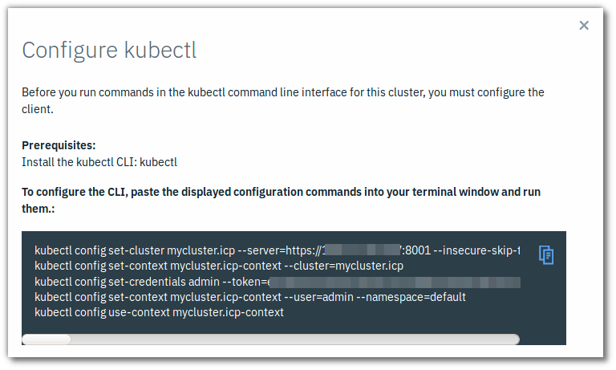

# Cloud coffee lab guide

## Provision ICP

> You will be provided a pre-installed cluster instance in IBM Cloud (Softlayer).

## Access ICP Master server

UI login:

    https://<master_ip>:8443
    admin/admin

CLI session:

    ssh root@<master_IP>

## Guided demo

> Follow the on-screen demonstration

- Accessing cluster UI
- Catalog and managing apps
- Managing workloads
- Metering, Monitoring, Logging

## TASK: Initialize and explore CLI environment

### Install the Kubernetes command line interface kubectl
	
	docker run -e LICENSE=accept --net=host -v /usr/local/bin:/data ibmcom/icp-inception:2.1.0.1 cp /usr/local/bin/kubectl /data

To obtain the configuration details from the management console:

1. Log in to your cluster management console. See Accessing your IBM Cloud Private cluster by using the management console.

2. Select *User Name > Configure* client. The cluster configuration details display and resemble the following code:  

    

3. In these details, *master_ip* is the IP address of the master node for your IBM Cloud Private cluster.

4. Copy and paste the configuration information to your command line, and press Enter. Hint: Click the icon on the right to copy all lines into the clipboard.

### Setup kubectl autocompletion

    sudo apt-get install bash-completion
    echo 'source <(kubectl completion bash)' >> ~/.bashrc
    source <(kubectl completion bash)

### Basic kubectl commands

Check this Kubernetes CLI cheat-sheet:  
https://kubernetes.io/docs/reference/kubectl/cheatsheet/

## TASK: Deploy a cloud-native microservices demo application

In this tutorial, you install and run a cloud-native microservices application on an IBM® Cloud Private platform on Kubernetes. The application implements a simple storefront that displays a catalog of computing devices.

Follow the link for instructions.  
https://www.ibm.com/cloud/garage/tutorials/cloudnative-microservices-cloud-private?task=3

Note, the online tutorial assumes thata you reserve and provision an ICP instance hosted on Skytap. You may explore this option if you like, but we recommend that you rather use your workshop ICP instance.

## TASK: Deploy DB2 or MQ middleware app from catalog

**Objective**

- Learn how to deploy a catalogue application as service to ICp using Docker container and Kubernetes cluster.
- Learn to use ICP catalog and other UI functions
- Learn to use basic kubernetes CLI commands
- Learn to configure storage volume for use in the kubernetes cluster

You can choose to deploy one of the following middleware applications. Click on the links for detailed instructions.

- [DB2](./deployDB2.md)
- [MQ](./deployMQ.md)

Note, these recipes have been inspired by a more complex demo use-case that simulates a task of an application team who has developed a microservice-based web application, **StockTrader** and is about to deploy it to the ICp environment. 

## TASK: Deploy Java EE appplication using IBM Microservices Builder

**Objective:**

- Learn to setup the development environment and Microservices Builder in ICP
- Use the dev tools to create a simple application based on microservices pattern template
- Deploy the microservice app in ICP with Helm
- Learn to push custom images to local docker image registry

### Install IBM Cloud CLI with ICP and Dev plugins

1. Download and install IBM Cloud CLI from: https://console.bluemix.net/docs/cli/reference/bluemix_cli/download_cli.html#download_install

    For Linux:
        
        curl -fsSL https://clis.ng.bluemix.net/install/linux | sh

2. From the IBM Cloud Private management console, click *Menu > Command Line Tools > Cloud Private CLI*. Or from command line:

        curl -k -O https://<master_IP>:8443/api/cli/icp-linux-amd64 

3. Install ICP plugin

        bx plugin install /<path_to_installer>/<cli_file_name>
        bx pr --help

4. Log in to your cluster

        bx pr login -a https://<master_ip_address>:8443 --skip-ssl-validation

5. Install Dev plugin

        bx plugin install dev

**Note:** Possible shortcut for the steps 1-3,5 above:

    curl -sL https://ibm.biz/idt-installer | bash

See: https://console.bluemix.net/docs/cloudnative/idt/index.html

### Build and deploy simple microservice app - manual build

Create app template

    bx dev create

Explore your project directory

    cd <projectname>

Build your app

    bx dev build

Run app
    
    bx dev run

Tag image

    docker tag myjavamicroservice:latest myjavamicroservice:v1.0.0

Push the new app image to ICP's local image registry

    docker login mycluster.icp:8500
    docker tag <projectname>:v1.0.0 mycluster.icp:8500/default/<projectname>:v1.0.0
    docker push mycluster.icp:8500/default/<projectname>:v1.0.0

Deploy to ICP using Helm

    helm install chart/<projectname>

---

